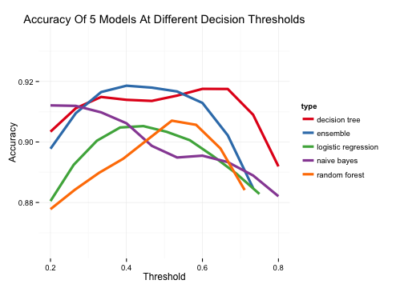

New Orleans Abatement Analytics

---------------

## Navigation

  *  [Docs](docs.html)
  *  [Data Cleaning](reports/munge.html)
  *  [Analysis](reports/analysis.html)
  *  [_Download this repository_](nola.zip)

## Overview
  
* Using a dataset of 603 annotated cases of abatement decisions, Enigma developed
a data processing and modeling pipeline in `R` capable of over 92% accuracy.

* Data is initially [cleaned](reports/munge.html) by standardizing and converting 
all codes to numeric vectors. Reviewer names are joined as well as an array of geo-identifiers (council distrincts, voting precincts, census tracts).

* Missing data is imputed using Random Forest regression.

* Five [classifcation models](reports/analysis.html) are fit, including a custom ensemble method.

* Predictions and errors are mapped to visualize potential the impact of the model's
decisions.

<h4>Probability of Demolition by Census Tract</h3>

<iframe width='90%' height='500' frameborder='0' src='http://enigmaio.cartodb.com/viz/12640768-5f8e-11e4-a58d-0e4fddd5de28/embed_map' allowfullscreen webkitallowfullscreen mozallowfullscreen oallowfullscreen msallowfullscreen></iframe>

<h4>Model Error by Census Tract</h3>

<iframe width='90%' height='500' frameborder='0' src='http://enigmaio.cartodb.com/viz/d2802466-5f8c-11e4-bbf7-0e853d047bba/embed_map' allowfullscreen webkitallowfullscreen mozallowfullscreen oallowfullscreen msallowfullscreen></iframe>

<h4>Probability of Demolition by Council District</h3>

<iframe width='90%' height='500' frameborder='0' src='http://enigmaio.cartodb.com/viz/97ac4da4-5f8e-11e4-8e5d-0e018d66dc29/embed_map' allowfullscreen webkitallowfullscreen mozallowfullscreen oallowfullscreen msallowfullscreen></iframe>

