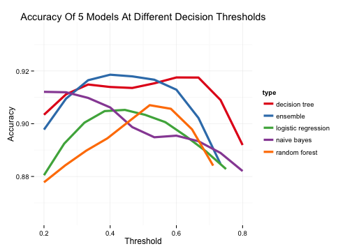

<center></center>
<center>New Orleans Abatement Analytics</center>
---------------

## Navigation
  *  [Overview](../index.html)
  *  [Docs](../docs.html)
  *  [Data Cleaning](munge.html)
  *  [_Download this repository_](nola.zip)

### Setup:
_IGNORE_

```r
rm(list=ls())
require(plyr)
```

```
## Loading required package: plyr
```

```r
require(stringr)
```

```
## Loading required package: stringr
```

```r
require(ggplot2)
```

```
## Loading required package: ggplot2
## Loading required package: methods
```

```r
require(reshape2)
```

```
## Loading required package: reshape2
```

```r
require(randomForest)
```

```
## Loading required package: randomForest
## randomForest 4.6-10
## Type rfNews() to see new features/changes/bug fixes.
```

```r
require(e1071)
```

```
## Loading required package: e1071
```

```r
require(rpart)
```

```
## Loading required package: rpart
```

```r
require(rpart.plot)
```

```
## Loading required package: rpart.plot
```

```r
options(scipen=999)
```

### Data Sources
Data is [initially cleaned](munge.html) before the analysis step. In the cleaning process,
all codes are standardized and converted to numeric vectors. Reviewer codes are joined
as well as an array of geo-identifiers (council distrincts, voting precincts, census tracts).


```r
wd <- '/Users/brian/enigma/analytics-projects/nola/' # set your working directory here.
setwd(wd)
infile <- paste0(wd, 'data/clean_abatement_data.Rdata')
load(infile)
```

### Model Variables
Through an iterative process, we decided on the 
following independent variables to model,
though these can be changed / tweaked / compared easily.
* `median_rent` - the median rent in the property's assoicated census tract
* `population` - the population in the property's assoicated census tract
* `character_code` - the subjective character of the property (ie does it have historical value?)
* `foundation_code`- the subjective quality of the property's foundation.
* `exterior_code` - the subjective quality of the property's exterior.
* `roof_code` - the subjective quality of the property's roof.
* `market_code` - a subjective estimate of the property's market value.
* `vacant_lot_revised_code` - whether the property is a vacant log.
* `reviewer` - the property's reviewer'


```r
#grab vars for model
model_vars = c(
  "recommendation_code",
  "median_rent",
  "population",
  "character_code",
  "foundation_code",
  "exterior_code",
  "roof_code",
  "market_code",
  "vacant_lot_revised_code",
  "reviewer"
  )
md <- d[,model_vars]
```

Notes:
* **overall_character_code** was removed since it was 
covariant with all other condition codes. 

* Two variables were added from the census
  - **popluation** (total popluation for the census tract)
  - **median_rent** (median rent). 
  - These variables were included by joining each property to its corresponding census tract-level metadata. 

### Cross-tabulations on Dependent Variable

By cross-tabulating all independent variables on the dependent variable, 
we get a sense of the factors that will drive the model.

Some Observations:

* Properties with low **character_code** are much more likely to be  
demolished by the city, while vacant lots (**vacant_lot_revised_code**) are more likely to be sold. 
* Properties with low **foundation_code**, **exterior_code**, and **roof_code**
are more likely to be demolished. These variables are also highly covariant.
* **market_code** seems to be a less reliabled predictor of recommendations.


```r
# aggregate dep var by another variable.
analyze_recommendation <- function(d, var, hist=F) { 
  
  #
  #
  #

  if (hist) {
    
    df <- data.frame()
    h_sell = hist(d[d$recommendation_code==1,var], plot=FALSE)
    h_demolish = hist(d[d$recommendation_code==0,var], breaks=h_sell$breaks, plot=FALSE)
    var <- "brk"
    
    for (i in 1:length(h_sell$breaks)) {

      row <- data.frame(
        brk = paste0("_", (h_sell$breaks[i])),
        sell = h_sell$counts[i],
        demolish = h_demolish$counts[i]
        )

      df <- rbind(df, row)
    }
    
  } else {

    df <- ddply(d, var, 
            function(d) {
              n <- nrow(d)
              n_sell <- sum(d$recommendation_code)
              data.frame(
                sell = n_sell,
                demolish = n - n_sell)
          })
     }

    # melt
    out <- melt(df, id.vars=var)
    out$recommendation <- ordered(out$variable, level=c('demolish', 'sell'))
    out$variable <- NULL

    return (out) 
}

plot_reccomendation <- function(df, var, hist=F) { 
  
  #
  #
  #

  
  dmd <- analyze_recommendation(df, var, hist)
  
  if (hist) {
    nvar <- "brk"
  } else {
    nvar <- var
  }

  ggplot(dmd, aes_string(x=nvar, y='value', fill='recommendation')) +
    scale_fill_manual(values=c('tomato', 'steelblue')) +
    geom_bar(stat='identity') +
    xlab(var) + 
    ylab('Total decisions') +
    ylim(0, 300) + 
    labs(title=paste('recommendations by', var)) + 
    theme_minimal()
}

plot_all_comparisons <- function(num_vars=c('population', 'median_rent')) { 
  
  #
  #
  #

  
  for (var in names(md)) {
  
    if (var != 'recommendation_code') {
  
      if (var %in% num_vars) {
        hist <- T
  
      } else {
        hist <- F
      }

      print(plot_reccomendation(md, var, hist))
    }
  } 
}
```
### Comparison Plots

```r
plot_all_comparisons()
```

         

### Model Selection

#### Model Utilities

```r
# helper fx
impute_data <- function(m, data) { 
  
  #
  #
  #

  return(rfImpute(m, data))
}

split_data <- function(data, split=0.6) { 
  
  #
  #
  #

  n <- nrow(data)
  samp <- sample(1:n, n*split)
  train <- data[samp, ]
  test <- data[-samp,]
  list(train=train, test=test)
}

analyze_model_output <- function(output, type, cutoff) { 
  
  #
  #
  #

  output$predicted <- as.numeric(ifelse(output$p_sell >= cutoff, 1, 0))
  output$error <- abs(as.numeric(output$actual) - as.numeric(output$p_sell))
  output$variance <- output$error^2
  output$type <- type
  return (output)
}
# given a dataframe with actual and predicted columns, compute the accuracy
calc_accuracy <- function(output, type) { 

  #
  #
  #

  accuracy <- length(which(output$actual == output$predicted)) / nrow(output)
  return(data.frame(accuracy=accuracy, type=type))
}

precision_matrix <- function(output) {

  #
  #
  #

  tab <- table(output$actual, output$predicted)

  return( data.frame(
    true_demolish = tab[1,1],
    false_demolish = tab[2,1],
    demolish_accuracy = tab[1,1] / sum(tab[,1]),
    true_sell = tab[2,2],
    false_sell = tab[1,2],
    sell_accuracy = tab[2,2] / sum(tab[,2])
  ))
}

process_model_output <- function(output, type, model, cutoff) {
  
  #
  #
  #

  output <- analyze_model_output(output, type, cutoff)
  p_matrix <- precision_matrix(output)
  accuracy <- calc_accuracy(output, type)
  
  # return
  return(list(
      output = output, 
      accuracy = accuracy, 
      model = model, 
      precision_matrix = p_matrix
    ))
}
```

#### Logistic Regression


```r
# train a logistic regression
glm_train <- function(m, dat, split=0.6, cutoff=0.5) { 
  
  #
  #
  #
  
  # what type of model is this?
  type <- 'logistic regression'
  
  # fit the model to the training data
  model <- glm(m, data=dat$train, family='binomial') 
  
  # predict withheld data
  predicted <- predict(model, dat$test, type='response')
  
  # format output with standard fields
  actual <- as.numeric(as.character(dat$test$recommendation_code))
  output <- data.frame(
    actual=actual, 
    p_demolish = 1-predicted, 
    p_sell = predicted
  )
  
  return( process_model_output(output, type, model, cutoff) )
}
```

#### Naive Bayes

```r
# train a naive bayes classifier
nb_train <- function(m, dat, split=0.6, cutoff=0.5) { 
  
  #
  #
  #
  
  # what type of model is this?
  type <- 'naive bayes'
  
  # split independent / dependent vars
  X_train <- dat$train[,-grep('recommendation_code', names(dat$train))]
  y_train <- dat$train[,c('recommendation_code')]
  
  # fit the model to the training data
  model <- naiveBayes(X_train, y_train, laplace = 3)
  
  # predict withheld data
  X_test <- dat$test[,-grep('recommendation_code', names(dat$test))]
  y_test <- dat$test[,c('recommendation_code')]
  predicted <- data.frame(predict(model, X_test, type="raw"))
  
  # format output with standard fields
  names(predicted) <- c('p_demolish', 'p_sell')
  actual <- as.numeric(as.character(dat$test$recommendation_code))
  output <- data.frame(actual=actual, predicted)
  
  return( process_model_output(output, type, model, cutoff) )
}
```

#### Decision Tree

```r
# train a decision tree
dt_train <- function(m, 
              dat, 
              split=0.6, 
              cutoff=0.5, 
              control=rpart.control(minsplit=31, cp=0)) { 

  #
  #
  #
  
  # what type of model is this?
  type <- 'decision tree'
  
  # fit the model to the training set
  model <- rpart(m, 
    method="class", 
    data=dat$train,
    control=control
  )
  
  # predict withheld data
  predicted <- data.frame(predict(model, dat$test, "prob"))
  
  # format output with standard fields
  names(predicted) <- c('p_demolish', 'p_sell')
  actual <- as.numeric(as.character(dat$test$recommendation_code))
  output <- data.frame(actual=actual, predicted)

  return( process_model_output(output, type, model, cutoff) )
}
```

#### Random Forest

```r
# train a random forest model
rf_train <- function(m, dat, split=0.6, cutoff=0.5) { 
  
  #
  #
  #
  
  # what type of model is this?
  type <- 'random forest'
  
  # fit the model to the training data
  model <- randomForest(m, data=dat$train, importance=TRUE,
            proximity=TRUE, na.action = na.omit, 
            ntree=20, nodesize=5, mtry=9
          )
  
  # predict withheld data
  predicted <- predict(model, dat$test, type = "vote")
  
  
  # format output with standard fields
  actual <- as.numeric(as.character(dat$test$recommendation_code))
  output <- data.frame(actual, predicted)
  names(output)[2:3] <- c("p_demolish", "p_sell")
  
  return( process_model_output(output, type, model, cutoff) )
}
```


#### Ensemble

```r
# train an ensemble of the four models.
ensemble_train <- function(m, dat, split=0.6, cutoff=0.5) { 
  
  #
  #
  #
  
  # what type of model is this?
  type = 'ensemble'
  
  # run all of our models
  dm <- dt_train(model, dat=dat, cutoff=cutoff)
  rm <- rf_train(model, dat=dat, cutoff=cutoff)
  gm <- glm_train(model, dat=dat, cutoff=cutoff)
  nm <- nb_train(model, dat=dat, cutoff=cutoff)
  
  # summarize output
  models_psell <- data.frame(
                    dm$output$p_sell, 
                    rm$output$p_sell, 
                    gm$output$p_sell, 
                    nm$output$p_sell
                  )
  p_sell <- rowMeans(models_psell)
  p_demolish <- 1 - p_sell
  
  # determine ensemble prediction
  predicted <- as.numeric(ifelse(p_sell >= cutoff, 1, 0))
  
  # format output with standard fields
  actual <- as.numeric(as.character(dat$test$recommendation_code))
  output <- data.frame(actual, p_sell, p_demolish, stringsAsFactors=F)

  return( 
    process_model_output(
      output, 
      type, 
      cutoff=cutoff, 
      model=list(dm, rm, gm, nm)
    ))
}
```

#### Cross Validation

```r
# cross validate all models.
cross_validation <- function(m, data, split=0.6, cutoff=0.8, k=10, impute=F) { 
  
  #
  #
  #
  
  # output formats.
  output <- data.frame()
  acc <- data.frame()
  
  # rerun model train/test cycle k times, recording outcomes.
  if (impute) {
    data <- impute_data(model, data)
  }
  
  for (i in 1:k) {
    # cat('Iteration', i, 'of', k, '\n')
    dat <- split_data(data, split=split)
    
    # run an iteration of a model
    dm <- dt_train(model, dat=dat, cutoff=cutoff)
    rm <- rf_train(model, dat=dat, cutoff=cutoff)
    gm <- glm_train(model, dat=dat, cutoff=cutoff)
    nm <- nb_train(model, dat=dat, cutoff=cutoff)
    em <- ensemble_train(model, dat=dat, cutoff=cutoff)
    
    # build up dataframe of outputs.
    output <- rbind(output, dm$output, rm$output, gm$output, nm$output, em$output)
    acc <- rbind(acc, dm$accuracy, rm$accuracy, gm$accuracy, nm$accuracy, em$accuracy)
  }
  return(list(output=output, accuracy=acc))
}
```

#### Threshold Analytics

```r
# compute accuracy for different models + cutoff points 
threshold_analysis <- function(m, data, k=5, split=0.6, impute=T, freq=0.05) { 
  
  #
  #
  #

  op <- data.frame()

  if (impute) {
    # cat('Imputing data \n')
    data <- impute_data(model, data)
  }
  
  cutoffs <- seq(0.2, 0.8, freq)

  for (cutoff in cutoffs) {
    # cat('Testing', cutoff, 'as cutoff point \n')
    m <- cross_validation(model, data=data, k=k, split=split, cutoff=cutoff, impute=F)
    tmp <- t(t(tapply(m$accuracy$accuracy, m$accuracy$type, median)))
    o <- data.frame(type = row.names(tmp), accuracy=as.numeric(tmp))
    o$cutoff <- cutoff
    
    op <- rbind(op, o)
  }
  return(op)
}
```


```r
# convert outcome to factor
md$recommendation_code <- as.factor(md$recommendation_code)

# settings for models
```

#### Imputation
We use a random forest regression to estimate the likely 
values of the missing observations. 


```r
# impute data
model <- recommendation_code ~ .
md <- impute_data(model, md)
```

#### Cross-Validation tests across all Models.

We developed five models:
 * logistic regression (via `glm`)
 * naive bayes (via `e1071`)
 * decision tree (via `rpart`)
 * random forest (via `RandomForest)
 * ensemble (an ensemble of the above four models.)

Testing these models with a 60/40 split with 10-folds cross validation,
we get the following results:


```r
# relative accuracy of models after k-folds cross validation with naive threshold
cv_output <- cross_validation(model, data=md, impute=F, split=0.6, k=10, cutoff=0.5)
tapply(cv_output$accuracy$accuracy, cv_output$accuracy$type, median)
```

```
##       decision tree       random forest logistic regression 
##              0.9181              0.9013              0.9034 
##         naive bayes            ensemble 
##              0.8992              0.9181
```

#### Threshold Analysis

Another concern is how to properly set the the decision threshold of the model.

By performing multiple cross validation tests across many different cutoff 
values, we can get a sense for the optimaal threshold.


```r
# run 5 different models at different cutoff levels, plotting the results
ac_output <- threshold_analysis(model, data=md, k=3, freq=0.025, impute=F)

# plot results
ggplot(ac_output, aes(x=cutoff, y=accuracy, color=type)) + 
  stat_smooth(size=1.5, alpha=0.6, n=10, se=F, method = "loess") + 
  theme_minimal() + 
  scale_color_brewer(palette='Set1') + 
  xlab('Threshold') + 
  ylab('Accuracy') + 
  ylim(0.865, 0.935) +
  labs(title='Accuracy Of 5 Models At Different Decision Thresholds')
```

 

#### Model Comparison

While the two highest performing models - ensemble, and random forest - have 
similar overall accuracy, the `ensemble` model performs better on demolitions.

##### Ensemble

```r
# run decision tree at optimal cutoff on ALL data
md$recommendation_code <- as.factor(md$recommendation_code)
dat <- split_data(md, split=0.6)
m <- ensemble_train(recommendation_code ~ ., dat=dat, cutoff=.3)
m$accuracy
```

```
##   accuracy     type
## 1   0.9118 ensemble
```

```r
m$precision_matrix
```

```
##   true_demolish false_demolish demolish_accuracy true_sell false_sell
## 1            34              4            0.8947       183         17
##   sell_accuracy
## 1         0.915
```

##### Decision Tree

The tree  shows how recommendations are largely driven by the character and 
condition of a propery.


```r
m <- dt_train(
  recommendation_code ~ ., 
  dat=dat, cutoff=.4, 
  control=rpart.control(minsplit=23, cp=0)
)
m$accuracy
```

```
##   accuracy          type
## 1    0.916 decision tree
```

```r
m$precision_matrix
```

```
##   true_demolish false_demolish demolish_accuracy true_sell false_sell
## 1            37              6            0.8605       181         14
##   sell_accuracy
## 1        0.9282
```

```r
# plot the tree
prp(
  m$model, 
  main='Decision Tree for Housing Abatements',
  extra=106,
  varlen=20,# display prob of survival and percent of obs
  fallen.leaves=F, # put the leaves on the bottom of the page
  branch=.33, # change angle of branch lines
  faclen=0, # do not abbreviate factor levels
  shadow.col=NULL, # shadows under the leaves
  branch.lty=1, # draw branches using dotted lines
  split.cex=1.2, # make the split text larger than the node text
  split.prefix="is ", # put "is " before split text
  split.suffix=" ?", # put "?" after split text
  split.box.col="steelblue", # lightgray split boxes (default is white)
  split.border.col="darkgray", # darkgray border on split boxes
  split.round=.5 # round the split box corners a tad
) 
```

 

### Spatial Analysis


```r
predict_iter <- function(i) { 
  
  #
  #
  #
  
  agg <- data.frame(d[,agg_vars], md)
  dat <- split_data(agg, split=0.5)
  dat2 <- dat
  dat2$train <- dat$train[,!names(dat$train) %in% agg_vars]
  dat2$test <- dat$test[,!names(dat$test) %in% agg_vars]
  
  m <- ensemble_train(final_m, dat=dat2, cutoff=0.3)
  out <- data.frame(dat$test[,agg_vars], m$output)
  out$iter <- i
  return( out )
}

bootstrap_predictions <- function(n) { 
  
  #
  #
  #

  return( ldply(1:n, predict_iter) )
}

agg_predictions <- function(df, var){ 
  
  #
  #
  #

  ddply(df, var, summarize,
        p_sell = mean(p_sell),
        p_demolish = mean(p_demolish),
        error = mean(error),
        variance = mean(variance)
      ) 
}

dump_aggregation <- function(var) { 
  
  #
  #
  #

  agg_pred <- agg_predictions(predictions, var)
  f <- paste0(wd, 'data/', var, '_agg.csv')
  write.csv(agg_pred, f, row.names=F)
  agg_pred
}
```
Now that we have a fairly robust model, let's explore how it performs
at different levels of spatial aggregation. To do so, we'll predict recommendations
for each property 500 times and then average various performance metrics at
different levels.

Below are plots of the model's error and predilection towards demolition recommendations 
across the city of New Orleans.'


```r
# aggregation-friendly dataframe
agg_vars = c('geoid', 'councildis', 'precinctid', 'case_number')

# final model object
final_m <- recommendation_code ~ 
  median_rent + 
  popluation + 
  character_code + 
  foundation_code + 
  exterior_code + 
  roof_code + 
  market_code + 
  vacant_lot_revised_code + 
  reviewer

# bootstrap predictions
predictions <- bootstrap_predictions(n=500)

# dump predictions 
out <- lapply(agg_vars, dump_aggregation)
```

<h3>Probability of Demolition by Census Tract</h3>

<iframe width='90%' height='500' frameborder='0' src='http://enigmaio.cartodb.com/viz/12640768-5f8e-11e4-a58d-0e4fddd5de28/embed_map' allowfullscreen webkitallowfullscreen mozallowfullscreen oallowfullscreen msallowfullscreen></iframe>
<h3>Model Error by Census Tract</h3>

<iframe width='90%' height='500' frameborder='0' src='http://enigmaio.cartodb.com/viz/d2802466-5f8c-11e4-bbf7-0e853d047bba/embed_map' allowfullscreen webkitallowfullscreen mozallowfullscreen oallowfullscreen msallowfullscreen></iframe>

<h3>Probability of Demolition by Council District</h3>
<iframe width='90%' height='500' frameborder='0' src='http://enigmaio.cartodb.com/viz/97ac4da4-5f8e-11e4-8e5d-0e018d66dc29/embed_map' allowfullscreen webkitallowfullscreen mozallowfullscreen oallowfullscreen msallowfullscreen></iframe>

### Logistic Regression Weights 

Below we fit a simple logistic regression to get the weights of different variables:


```r
head(dat$train)
```

```
##     recommendation_code median_rent population character_code
## 141                   1         704       3350         0.0000
## 15                    1         886       3412         1.0000
## 359                   0         642        657         0.0000
## 175                   1         767       5763         0.9623
## 771                   1         745       1547         0.9570
## 607                   0         695       2422         1.0000
##     foundation_code exterior_code roof_code market_code
## 141           2.000         2.000     2.000           2
## 15            1.000         1.000     1.000           1
## 359           4.000         4.000     4.000           4
## 175           1.209         1.446     1.254           1
## 771           1.238         1.489     1.287           1
## 607           3.000         3.000     2.452           3
##     vacant_lot_revised_code reviewer
## 141                0.287646     Demo
## 15                 0.000000       AW
## 359                0.008805       DG
## 175                1.000000       JN
## 771                1.000000     Demo
## 607                0.000000     Demo
```

```r
m <- glm_train(
  recommendation_code ~ character_code + foundation_code + exterior_code + roof_code + market_code + vacant_lot_revised_code, 
  dat=dat, cutoff=.4
)


m$accuracy
```

```
##   accuracy                type
## 1   0.9076 logistic regression
```

```r
m$precision_matrix
```

```
##   true_demolish false_demolish demolish_accuracy true_sell false_sell
## 1            33              4            0.8919       183         18
##   sell_accuracy
## 1        0.9104
```

```r
summary(m$model)
```

```
## 
## Call:
## glm(formula = m, family = "binomial", data = dat$train)
## 
## Deviance Residuals: 
##    Min      1Q  Median      3Q     Max  
## -3.062  -0.299   0.126   0.224   2.443  
## 
## Coefficients:
##                         Estimate Std. Error z value     Pr(>|z|)    
## (Intercept)               4.2505     1.1027    3.85      0.00012 ***
## character_code            3.0733     0.5309    5.79 0.0000000071 ***
## foundation_code          -0.7975     0.4037   -1.98      0.04824 *  
## exterior_code            -0.6269     0.4533   -1.38      0.16668    
## roof_code                -0.2557     0.3658   -0.70      0.48459    
## market_code              -0.1544     0.2210   -0.70      0.48474    
## vacant_lot_revised_code   0.0685     0.9473    0.07      0.94235    
## ---
## Signif. codes:  0 '***' 0.001 '**' 0.01 '*' 0.05 '.' 0.1 ' ' 1
## 
## (Dispersion parameter for binomial family taken to be 1)
## 
##     Null deviance: 417.02  on 355  degrees of freedom
## Residual deviance: 150.69  on 349  degrees of freedom
## AIC: 164.7
## 
## Number of Fisher Scoring iterations: 6
```

So the model would then be:


```r
intercept <- as.numeric(m$model$coef[1])
coefs <- names(m$model$coef)[2:length(m$model$coef)]
weights <- as.numeric(m$model$coef)[2:length(m$model$coef)]

cat("P(sell) =", "\n", intercept, " + ", "\n", paste(paste(weights, coefs, sep=" * ", collapse=" +\n")))
```

```
## P(sell) = 
##  4.25  +  
##  3.07330583279131 * character_code +
## -0.7974809978075 * foundation_code +
## -0.62686645897141 * exterior_code +
## -0.255666431042413 * roof_code +
## -0.154408375392846 * market_code +
## 0.0685140022712357 * vacant_lot_revised_code
```
